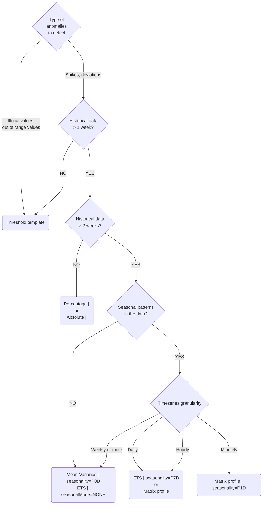

import { Callout } from 'nextra/components';

## Anomaly detection algorithms

Before diving into algorithms, it is important to understand the principles of good alerting systems.  
If not done cautiously, alert pipelines can quickly get messy, generate alert spam, alert fatigue, or miss  important anomalies.  
When an alert triggers, it should be easy to understand why.
Similarly, if an alert doesn't fire, it should be easy to check and see what happened.
The more complicated an alert condition becomes, the harder it is to understand and debug[^1].

The above is theory that applies well to simple metric monitoring, like CPU usage in computers,
but it can be harder to apply for operations and business monitoring, the core use cases of ThirdEye.
Business monitoring is full of complex patterns, special events and seasonalities [^2].

When designing alerts, you will have to find your place on the quadrant below.

 

In ThirdEye, alert rules tend to be more complex than in other systems, and RCA algorithms help you make sense of the anomalies.
This does not mean you should start by complex alerts.

Good practices to apply:
- Do not try to monitor everything. Think about what is important and what is actionable.
- Start simple and iterate[^3] to finetune your alert.
- Pareto principle applies. Root for the 80% before going for the very complex 20%. [^4]

With this in mind, here is a review of the commonly used detector algorithms in ThirdEye.

## Detection algorithms
<Callout>
Click on a detector name to go to its template documentation.
</Callout>

### [Threshold](../templates/startree-threshold.md)

Simplest method. Detect an anomaly if a metric is above a maximum threshold or below a minimum threshold.
Good for signals that are mostly flat, or should not go in certain range.  
 
Pros: easy to configure and understand.  
Cons: does not manage seasonalities. You have to estimate noise yourself.

### [Mean Variance](../templates/startree-mean-variance.md)
Estimate the mean. Estimate the standard deviation, and consider the standard deviation is caused by noise only.  
If the value is above `mean + n*std` or below `mean + n*std`, detects an anomaly.  
Good if your signal is flat with a lot of noise.
 
Pros: No need to estimate noise. Can adapt if noise changes.  
Cons: Does not manage seasonalities.

### [Percentage change](../templates/startree-percentage-rule.md)
Compare current timeseries to a baseline. If the percentage change is above a certain threshold, detects an anomaly.  
A simple way of managing seasonalities. You define the baseline yourself.

A common usage is to compare your current value to the value of last weeks.
For instance, compare Thursday 8, 8pm to Thursday 1, 8pm.
This way, you manage hourly and weekly seasonalities.

Most of the time, percentage rule is easy to understand, but because percentage rules use division, it can be sensitive with values close to 0.
It can also be sensitive to noise: if you define a percentage change limit of 20%, and the noise is such that it is common to do -+10% around the mean,  you will
have false positives when you have -10% in the baseline followed by +10% in the observed value.
 
Pros: easiest way to manage seasonality. Easy to understand.  
Cons: Sensitive to noise[^5]. Sensitive to big trends[^6].

### [Absolute change](../templates/startree-absolute-rule.md)
Compares current time series to a baseline. If the absolute change is above a certain threshold, detect it as an anomaly.
An alternative to percentage rule, that works better for noisy and small values.
 
Pros: alternative to avoid percentage rule pitfalls.  
Cons: the absolute change value is harder to set and understand than a percentage.

### [Exponential time smoothing (ETS)  ](../templates/startree-ets.md)
Exponential time smoothing (simple, double, Holt-Winters) methods[^7] are a set of statistical forecasting algorithm.
Timeseries are extracted as a sum of trend, seasonality and noise[^8]. The algorithm estimates these components.
This algorithm performs well for daily data and hourly data.  
Holt-Winters method is faster than most other ML methods while keeping a very good short-term forecasting performance.
The model detects an anomaly when the observed value is too far from the predicted value.
The sensitivity can be finetuned.
 

Pros: manages seasonality, trend and noise.  
Cons: as a model that heavily relies on historical data, it is sensitive to concept drift, false trends[^9], special events, bad data, etc.

### [MSTL](../templates/startree-mstl.md)
The MSTL method[^10] decomposes a timeseries in trend, multiple seasonal patterns and residuals.
Residuals can be seen as containing the noise and the outliers. If a residual goes outside the
expected residual range, it is considered an anomaly.
The complete algorithm is an adaptation of the `R` tsoutliers[^11] algorithm for online detection.
 

Pros: Robust to anomalies in historical data. Easier to finetune than ETS. Can perform better than ETS when there are multiple seasonal patterns.  
Cons: Slower than ETS. Control on how the model behaves is limited.

### [Matrix Profile](../templates/startree-matrix-profile.md)
The matrix profile method[^12] is a "direct" anomaly detection algorithm. It returns an anomaly score,
it does not return upper and lower bounds. Points are detected as an anomaly if they exceed a given threshold.
The matrix profile method only works well with seasonal patterns. It works well from minutely do daily data.
The idea of the algorithm is to compare snippets of the timeseries between each other. If one snippet does not look
like any other snippet, it has a high anomaly score.
 

Pros: Very fast. Great at high-frequency monitoring. Robust to anomalies in historical data. Easy to finetune.  
Cons: only good for timeseries with seasonal patterns. No lower/upper bound are provided, this can hinder the interpretation of anomalies.

### [Remote HTTP](../operators/anomaly-detector/http.md)
The Remote HTTP detector allows the anomaly detection to be performed by a remote HTTP service. The user can configure
the alert to point to a REST endpoint. This endpoint must be able to accept the thirdeye detection payload and respond
back with a specific response API. With this detector, you can use your favorite models in any language like R or Python.

## Choosing the right algorithm
To pick the correct algorithm, you can follow the decision chart below.
Make sure to look at your timeseries first. To display a timeseries in ThirdEye quickly, pick the
threshold template. See [How to create an alert](../../get-started-with-thirdeye/how-tos/alert/how-to-use-alert-creation-ui.md).
You can change the template easily, ThirdEye has an interactive feedback loop that makes it easy to try different configurations.

### Auomated Anomaly Detection Algorithm Recommendation and tuning (Based on data pattern during alert creation)
  

### Going further
If you want to implement your own model in ThirdEye, see create a detector documentation.

[^1]: Similar discussion here [https://netflix.github.io/atlas-docs/asl/alerting-philosophy/#keep-it-simple](https://netflix.github.io/atlas-docs/asl/alerting-philosophy/#keep-it-simple)
[^2]: This is why RCA algorithms are made available.
[^3]: See [percentage rule and noise](https://medium.com/@cdecatheu/data-quality-anomaly-detections-that-work-with-thirdeye-8fbce5d2f34a)
[^4]: It is not a coincidence that the Pareto principle was developed in the context of quality control.
See [https://en.wikipedia.org/wiki/Pareto_principle](https://en.wikipedia.org/wiki/Pareto_principle)
[^5]: See [percentage rule and noise](https://medium.com/@cdecatheu/data-quality-anomaly-detections-that-work-with-thirdeye-8fbce5d2f34a#8e80)
[^6]: See [percentage rule and big trends](https://medium.com/@cdecatheu/data-quality-anomaly-detections-that-work-with-thirdeye-8fbce5d2f34a#86ca)
[^7]: See [https://otexts.com/fpp3/expsmooth.html](https://otexts.com/fpp3/expsmooth.html)
[^8]: See [https://otexts.com/fpp2/tspatterns.html#tspatterns](https://otexts.com/fpp2/tspatterns.html#tspatterns)
[^9]: See a [discussion about false trends](https://medium.com/@cdecatheu/data-quality-anomaly-detections-that-work-with-thirdeye-8fbce5d2f34a#cee8).
[^10]: See [MSTL publiation](https://arxiv.org/abs/2107.13462).
[^11]: See [tsouliers introduction](https://robjhyndman.com/hyndsight/tsoutliers/).
[^12]: See [references here](https://www.cs.ucr.edu/~eamonn/MatrixProfile.html) and [introduction here](https://www.cs.ucr.edu/~eamonn/Matrix_Profile_Tutorial_Part1.pdf)
