# startree-ets-percentile-dx 
## Description 
Detect an anomaly if the metric is outside the prediction boundaries of a model combining a linear regression and an ETS forecasting algorithm. The regression model learns the effect of events The ETS model learns the level, trend and seasonality in the timeseries. Aggregation function with 2 operands: PERCENTILETDIGEST, DISTINCTCOUNTHLL,etc...
Use the `enumerationItems` property to configure the different dimensions to explore.
## Flowchart 

```mermaid
graph TD
subgraph dimension-exploration [Dimension exploration. For each enumeration:<br>]
impactProcessor>"impactProcessor<br>IMPACT "]--->childRoot
eventProcessor>"eventProcessor<br>EVENTS "]--->impactProcessor
offsetAggregationProcessor>"offsetAggregationProcessor<br>OFFSET_AGGREGATION "]--->eventProcessor
guardrailThresholdProcessor>"guardrailThresholdProcessor<br>THRESHOLD "]--->offsetAggregationProcessor
metricThresholdProcessor>"metricThresholdProcessor<br>THRESHOLD "]--->guardrailThresholdProcessor
timeOfWeekProcessor>"timeOfWeekProcessor<br>TIME_OF_WEEK "]--->metricThresholdProcessor
coldStartProcessor>"coldStartProcessor<br>COLD_START "]--->timeOfWeekProcessor
anomalyDetector[["anomalyDetector<br>ETS "]]--->coldStartProcessor
missingDataPointsFiller["missingDataPointsFiller<br>TimeIndexFiller "]--->anomalyDetector
currentDataWithHistoryFetcher[("currentDataWithHistoryFetcher<br>DataFetcher ")]--->missingDataPointsFiller
childRoot>"childRoot<br>ANOMALY_MERGER "]
eventsDataFetcher[("eventsDataFetcher<br>EventFetcher ")]--->anomalyDetector
eventsForFilterDataFetcher[("eventsForFilterDataFetcher<br>EventFetcher ")]--->eventProcessor
childRoot ---> END((END))
end
```

## Parameters 
### DATA
| name | description | default value |
| --- | --- | --- |
|aggregationColumn|The column to aggregate. Can be a derived metric.|-|
|aggregationFunction|The aggregation function to apply on the aggregationColumn. Example: `AVG`.|-|
|dataSource|The Pinot datasource to use.|-|
|dataset|The dataset to query.|-|
|monitoringGranularity|The period of aggregation of the timeseries. In ISO-8601 format. Example: `PT1H`.|-|
|timezone|Timezone used to group by time. In [TZ-identifier](https://en.wikipedia.org/wiki/List_of_tz_database_time_zones#List) format.  For instance, `UTC` or `US/Pacific`.|UTC|
|timeColumn|TimeColumn used to group by time. If set to AUTO (the default value), the Pinot primary time column is used.|AUTO|
|timeColumnFormat|Required if timeColumn is not AUTO. [Learn more](https://dev.startree.ai/docs/startree-enterprise-edition/startree-thirdeye/reference/operators/data-fetcher#timeformat-strings).||
|completenessDelay|The time for your data to be considered complete and ready for anomaly detection. In ISO-8601 format. Example: `PT2H`. [Learn more](https://dev.startree.ai/docs/startree-enterprise-edition/startree-thirdeye/concepts/alert-configuration#completenessdelay).|P0D|
|queryFilters|Filters to apply when fetching data. Prefix with `AND`. Example: `AND country='US'`|${queryFilters}|
|queryLimit|Maximum number of timeseries point to fetch.|100000000|
|aggregationParameter|The second argument of the aggregationFunction. Example: for `PERCENTILETDIGEST`: `95`.|-|

### DETECTION
#### MAIN
| name | description | default value |
| --- | --- | --- |
|lookback|Historical time period to use to train the model. In ISO-8601 format. Example: `P21D`.|-|
|sensitivity|The sensitivity of the model. The smaller, the less anomaly are detected.|-|
|metricMinimumValue|If set, the predicted value of the detector and the lower/upper bounds cannot be smaller than the given value. For instance, set it to 0 if your metric cannot have a negative value.|-|
|metricMaximumValue|If set, the predicted value of the detector and the lower/upper bounds cannot be bigger than the given value. For instance, set it to 100 if your metric cannot be bigger than 100.|-|
|pattern|Whether to detect an anomaly if it's a drop, a spike or any of the two.|UP_OR_DOWN|
|seasonalityPeriod|Biggest seasonality period to learn. In ISO-8601 format. Example: `P7D`.|-|
|alpha|ETS level smoothing factor. In `[0,1]`. `-1` means auto-optimized by BOBYQA.|-1|
|beta|ETS trend smoothing factor. In `[0,1]`. `-1` means auto-optimized by BOBYQA.|-1|
|gamma|ETS seasonal smoothing factor. In `[0,1]`. `-1` means auto-optimized by BOBYQA.|-1|
|phi|ETS trend smoothing factor. In `[0,1]`. `-1` means auto-optimized by BOBYQA. Only used if `trendMode` is set to `DAMPED`.|-1|
|robustInitialization|Experimental. Whether the model should be robust to anomalies in the historical data at the initialization phase. Requires at least 3 seasonal periods of lookback.|true|
|robustFitting|Experimental. Whether the model should be robust to anomalies in the historical data at the fitting phase. Requires at least 3 seasonal periods of lookback.|true|
|robustIntervalsLambda|Experimental. Whether the intervals should be robust to anomalies in the historical data. Between 0 and 1. If 0, intervals are not robust. The closer to 1, the more the confidence intervals depend on recent observations.|0.1|
|intervalsMethod|Method to compute intervals. In CONFIDENCE, PERCENTAGE, ABSOLUTE.|CONFIDENCE|
|errorMode|ETS error mode as defined [here](https://www.researchgate.net/publication/5179823_Prediction_Intervals_for_Exponential_Smoothing_State_Space_Models).|ADDITIVE|
|seasonalMode|ETS seasonal mode as defined [here](https://www.researchgate.net/publication/5179823_Prediction_Intervals_for_Exponential_Smoothing_State_Space_Models).|ADDITIVE|
|trendMode|ETS trend mode as defined [here](https://www.researchgate.net/publication/5179823_Prediction_Intervals_for_Exponential_Smoothing_State_Space_Models).|NONE|
|regressors|For advanced users. Additional list of features to add to the regression model. These additional features may help the model to learn the effect of events. Events features are created automatically. [Learn more](http://localhost:3000/docs/startree-enterprise-edition/startree-thirdeye/reference/operators/anomaly-detector/ets#regressors).|[]|
#### Events
| name | description | default value |
| --- | --- | --- |
|eventSqlFilter|Sql filter to apply when fetching events. [Learn more](https://dev.startree.ai/docs/startree-enterprise-edition/startree-thirdeye/reference/operators/event-fetcher#sql-filter)||
|eventLookaround|When fetching events, additional margin to apply on startTime and endTime to look around the timeframe. In ISO-8601 format. Example: `P1D`.|P1D|
|eventTypes|Type of events to fetch. Example: `["HOLIDAY", "DEPLOYMENT"]`. `[]` or `null` means no filtering. The default value `["__NO_EVENTS"]` means don't fetch events.|['__NO_EVENTS']|

### FILTER
#### Time of week
| name | description | default value |
| --- | --- | --- |
|daysOfWeek|Used to ignore anomalies that happen at specific time periods. A list of days. Anomalies happening on these days are ignored if timeOfWeekIgnore is true. Example: `["MONDAY", "SUNDAY"]`.|[]|
|hoursOfDay|Used to ignore anomalies that happen at specific time periods. A list of hours. Anomalies happening on these hours are ignored. Example: `[0,1,2,23]`|[]|
|dayHoursOfWeek|Used to ignore anomalies that happen at specific time periods. A mapping of `{DAY: [hours]}`. Anomalies happening on these timeframes are ignored if timeOfWeekIgnore is true. Example: `{"FRIDAY": [22, 23], "SATURDAY": [0, 1, 2]}`|{}|
#### Threshold
| name | description | default value |
| --- | --- | --- |
|thresholdFilterMin|Used to ignore anomalies that don't meet the thresholdFilter min and max. Example: set `thresholdFilterMin = 10` to ignore anomalies when the metric is smaller than 10. Can help ignore anomalies happening in low data regimes. Filter threshold minimum. If `-1`, no minimum threshold is applied.|-1|
|thresholdFilterMax|Used to ignore anomalies that don't meet the thresholdFilter min and max. Example: set `thresholdFilterMin = 10` to ignore anomalies when the metric is smaller than 10. Can help ignore anomalies happening in low data regimes. Filter threshold maximum. If `-1`, no maximum threshold is applied.|-1|
#### Guardrail metric
| name | description | default value |
| --- | --- | --- |
|guardrailMetricMin|Used to ignore anomalies that don't meet the guardrail threshold. Minimum threshold of the guardrail metric. If `-1`, no minimum threshold is applied.|-1|
|guardrailMetricMax|Used to ignore anomalies that don't meet the guardrail threshold. Maximum threshold of guardrailMetric. If `-1`, no maximum threshold is applied.|-1|
|guardrailMetric|Used to ignore anomalies that don't meet the guardrail threshold. Metric to use as a threshold guardrail. Example: `COUNT(*)` and set `guardrailMetricMin = 100` to ignore anomalies detected when there is less than 100 observations in the period.|COUNT(*)|
#### Simple baseline
| name | description | default value |
| --- | --- | --- |
|offsetBaselineFilterPattern|Used to ignore anomalies that are not detected as anomalies by a simple model. Whether to detect an anomaly if it's a drop, a spike or any of the two.|UP_OR_DOWN|
|offsetBaselineFilterSensitivity|Used to ignore anomalies that are not detected as anomalies by a simple model. Detection sensitivity. For instance with `offsetBaselineFilterIntervalsMethod=PERCENTAGE`, set 50 for a 50% percentage change threshold. With `offsetBaselineFilterIntervalsMethod=ABSOLUTE`, set 200 for a 200 absolute difference threshold between the metric and the baseline.|-1|
|offsetBaselineFilterIntervalsMethod|Used to ignore anomalies that are not detected as anomalies by a simple model. Method to compute intervals. `PERCENTAGE` or `ABSOLUTE`.|ABSOLUTE|
|offsetBaselineFilterModelOffsets|Used to ignore anomalies that are not detected as anomalies by a simple model. A list of offsets in ISO-8601 format to use as baseline. Eg `[P7D, P14D]` will compare the current value to the aggregation of the values of the 2 previous weeks.|['P7D']|
|offsetBaselineFilterModelAggregation|Used to ignore anomalies that are not detected as anomalies by a simple model. The aggregation function to use to combine historical values. In `MEDIAN`, `AVERAGE`, `MIN`, `MAX` and any of `PCTXXXXX` eg `PCT05` (5th percentile), `PCT95`, `PCT999` (99.9th percentile).|MEDIAN|
#### Special events
| name | description | default value |
| --- | --- | --- |
|eventFilterSqlFilter|Used to ignore anomalies that happen during events. Sql filter to apply on the events. [Learn more](https://dev.startree.ai/docs/startree-enterprise-edition/startree-thirdeye/reference/operators/event-fetcher#sql-filter)||
|eventFilterLookaround|Used to ignore anomalies that happen during events. Offset to apply on startTime and endTime to look around the timeframe. In ISO-8601 format. Example: `P1D`.|P2D|
|eventFilterTypes|Used to ignore anomalies that happen during events. List of event types to fetch by. Example: `["HOLIDAY", "DEPLOYMENT"]`. `[]` fetches all events. Use `["__NO_EVENTS"]` to disable.|['__NO_EVENTS']|
|eventFilterBeforeEventMargin|Used to ignore anomalies that happen during events. A period in ISO-8601 format that corresponds to a period that is also impacted by the event. Example: if beforeEventMargin is `P1D`, if event happens on `[Dec 24 0:00, Dec 25 0:00[`, the label will be applied to anomalies happening on `[Dec 23 0:00 and Dec 25 0:00[`|P0D|
|eventFilterAfterEventMargin|Used to ignore anomalies that happen during events. Same as eventFilterBeforeEventMargin at the end of the event.|P0D|
#### Impact
| name | description | default value |
| --- | --- | --- |
|impactThreshold|Used to ignore anomalies that don't meet the impact threshold. Impact filter threshold.|-1|

### POSTPROCESS
#### Data mutability
| name | description | default value |
| --- | --- | --- |
|mutabilityPeriod|Use if your data is mutable. ThirdEye will maintain the detection results up to date on the mutable period. For instance, if your last 10 days of data is mutable, set `P10D`. At each cron detection job, the detection results for the last 10 days will be updated.|P0D|
|reNotifyPercentageThreshold|For detection replay when data is mutable. If the percentage difference between an existing anomaly and a new anomaly on the same time frame is above this threshold, renotify. Combined with `reNotifyAbsoluteThreshold`. Both thresholds must pass to be re-notified. If zero, always renotify. If null or negative, never re-notifies.|-1|
|reNotifyAbsoluteThreshold|For detection replay when data is mutable. If the absolute difference between an existing anomaly and a new anomaly on the same time frame is above this threshold, renotify. Combined with `reNotifyPercentageThreshold`. Both thresholds must pass to be re-notified. If zero, always renotify. If null or negative, never re-notifies.|-1|
#### Anomaly merger
| name | description | default value |
| --- | --- | --- |
|mergeMaxGap|Maximum gap between 2 anomalies for anomalies to be merged. In ISO-8601 format. Example: `PT2H`. The default behavior is to merge consecutive anomalies only. To disable anomaly merging entirely, set this value to `P0D`.||
|mergeMaxDuration|Maximum duration of an anomaly merger. At merge time, if an anomaly merger would get bigger than this limit, the anomalies are not merged. In ISO-8601 format. Example: `P7D`.||

### RCA
| name | description | default value |
| --- | --- | --- |
|rcaAggregationFunction|The aggregation function to use for RCA. If the detection metric name is known to ThirdEye, this parameter is optional.||
|rcaIncludedDimensions|List of the dimensions (columns in the dataset) to use in RCA drill-downs. If not set or empty, all dimensions of the table are used. [Learn more](https://dev.startree.ai/docs/startree-enterprise-edition/startree-thirdeye/concepts/alert-configuration#dimensions).|[]|
|rcaExcludedDimensions|List of dimensions (columns in the dataset) to ignore in RCA drill-downs. If not set or empty, all dimensions of the table are used. rcaExcludedDimensions and rcaIncludedDimensions cannot be used at the same time.|[]|
|rcaEventTypes|A list of type to filter on for RCA. Only events that match such types will be shown in the RCA related events tab. [Learn more](https://dev.startree.ai/docs/startree-enterprise-edition/startree-thirdeye/concepts/alert-configuration#types).|[]|
|rcaEventSqlFilter|A Sql filter for RCA events. Only events that match the filter will be shown in the RCA related events tab. [Learn more](https://dev.startree.ai/docs/startree-enterprise-edition/startree-thirdeye/concepts/alert-configuration#sqlfilter).||

### DIMENSION_EXPLORATION
| name | description | default value |
| --- | --- | --- |
|enumerationItems|Array of enumerations. The detection pipeline will run for each enumeration.   The format is the following:   <code class="codeBlockLines_node_modules-@docusaurus-theme-classic-lib-theme-CodeBlock-Content-styles-module">[    {      "name": "US country",      "description": "slice for US only",      "params": {        "queryFilters": " AND country='US'"       }    }  ,... # other enumerations  ,]  </code>  To make a property configurable for each enumeration, ensure it is set to the special value:   `[DOLLAR]{myProperty}` - replace [DOLLAR] by the dollar character).  In the example above the `queryFilter` property must be set to   `[DOLLAR]{queryFilters}`.|-|
|enumerationItemIdKeys|List of keys to use to identify the enumeration.   The format is the following:   <code class="codeBlockLines_node_modules-@docusaurus-theme-classic-lib-theme-CodeBlock-Content-styles-module">[    "queryFilters"  ]  </code>  The keys must be present in the `params` object of each enumeration.   The keys will be used to generate the dimension exploration id.   The id will be used to identify the enumeration in the detection pipeline.|['queryFilters']|

