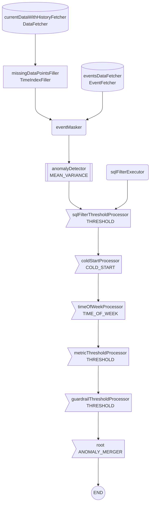

# startree-experimental-mean-variance-with-mask-percentile 
## Description 
Experimental. Detect an anomaly if the metric is not in `mean ± n*std`. `mean` and `std` (standard deviation) are estimated with historical data.  The amount of historical data to use is set with the `lookback` property. Aggregation function with 2 operands: PERCENTILETDIGEST, DISTINCTCOUNTHLL,etc...
## Flowchart 

## Parameters 
### DATA
| name | description | default value |
| --- | --- | --- |
|dataSource|The Pinot datasource to use.|-|
|dataset|The dataset to query.|-|
|aggregationColumn|The column to aggregate. Can be a derived metric.|-|
|aggregationFunction|The aggregation function to apply on the aggregationColumn. Example: `AVG`.|-|
|monitoringGranularity|The period of aggregation of the timeseries. In ISO-8601 format. Example: `PT1H`.|-|
|timezone|Timezone used to group by time. In [TZ-identifier](https://en.wikipedia.org/wiki/List_of_tz_database_time_zones#List) format.  For instance, `UTC` or `US/Pacific`.|UTC|
|timeColumn|TimeColumn used to group by time. If set to AUTO (the default value), the Pinot primary time column is used.|AUTO|
|timeColumnFormat|Required if timeColumn is not AUTO. [Learn more](https://dev.startree.ai/docs/startree-enterprise-edition/startree-thirdeye/reference/operators/data-fetcher#timeformat-strings).||
|completenessDelay|The time for your data to be considered complete and ready for anomaly detection. In ISO-8601 format. Example: `PT2H`. [Learn more](https://dev.startree.ai/docs/startree-enterprise-edition/startree-thirdeye/concepts/alert-configuration#completenessdelay).|P0D|
|queryFilters|Filters to apply when fetching data. Prefix with `AND`. Example: `AND country='US'`||
|queryLimit|Maximum number of timeseries point to fetch.|100000000|
|aggregationParameter|The second argument of the aggregationFunction. Example: for `PERCENTILETDIGEST`: `95`.|-|

### PREPROCESS
| name | description | default value |
| --- | --- | --- |
|eventMaskerSqlFilter|Used to mask periods based on events. Sql filter to apply when fetching events. [Learn more](https://dev.startree.ai/docs/startree-enterprise-edition/startree-thirdeye/reference/operators/event-fetcher#sql-filter)||
|eventMaskerLookaround|Used to mask periods based on events. Offset to apply on startTime and endTime to look around the timeframe when fetching events. In ISO-8601 format. Example: `P1D`.|P2D|
|eventMaskerTypes|Used to mask periods based on events. List of event types to fetch by. Example: `["HOLIDAY", "DEPLOYMENT"]`. `[]` fetches all events. Use `["__NO_EVENTS"]` to disable.|['__NO_EVENTS']|
|eventMaskerBeforeEventMargin|Used to mask periods based on events. A period in ISO-8601 format that corresponds to a period that should be included in the event. Example: if beforeEventMargin is `P1D` and the event happens on `[Dec 24 0:00, Dec 25 0:00[`, then the event will be considered to happen on `[Dec 23 0:00 and Dec 25 0:00[`|P0D|
|eventMaskerAfterEventMargin|Used to mask periods based on events. Same as eventMaskerBeforeEventMargin at the end of the event.|P0D|
|eventMaskerStrategy|Strategy to apply the mask. MASK_WHEN_IN_EVENT masks periods where an event happens. MASK_WHEN_OUT_OF_EVENT masks periods where an event does not happen.|MASK_WHEN_IN_EVENT|

### DETECTION
| name | description | default value |
| --- | --- | --- |
|lookback|Historical time period to use to train the model. In ISO-8601 format. Example: `P21D`.|-|
|sensitivity|The sensitivity of the model. The smaller, the less anomaly are detected.|-|
|lowerSensitivity|The sensitivity for the lower bounds. The smaller, the less anomaly are detected. If used, upperSensitivity must be set.|-|
|upperSensitivity|The sensitivity for the upper bounds. The smaller, the less anomaly are detected. If used, lowerSensitivity must be set.|-|
|upperBoundMultiplier|Factor applied to the upper bound, such that `finalUpperBound = upperBound * upperBoundMultiplier`. Can help to stabilize bounds. If not set, no factor is applied.|-|
|lowerBoundMultiplier|Factor applied to the lower bound, such that `finalLowerBound = lowerBound * lowerBoundMultiplier`. Can help to stabilize bounds. If not set, no factor is applied.|-|
|pattern|Whether to detect an anomaly if it's a drop, a spike or any of the two.|UP_OR_DOWN|
|seasonalityPeriod|Seasonality to consider when computing mean and variance. Possible values are `P7D` (weekly and smaller periods), `P1D` (daily and smaller periods), PT0S (no seasonality). Eg: with P7D, a Monday 12 AM value will be estimated from the mean and variance of the previous Monday 12 AM values. |PT0S|
|metricMinimumValue|If set, the predicted value of the detector and the lower/upper bounds cannot be smaller than the given value. For instance, set it to 0 if your metric cannot have a negative value.|-|
|metricMaximumValue|If set, the predicted value of the detector and the lower/upper bounds cannot be bigger than the given value. For instance, set it to 100 if your metric cannot be bigger than 100.|-|

### FILTER
#### Time of week
| name | description | default value |
| --- | --- | --- |
|daysOfWeek|Used to ignore anomalies that happen at specific time periods. A list of days. Anomalies happening on these days are ignored if timeOfWeekIgnore is true. Example: `["MONDAY", "SUNDAY"]`.|[]|
|hoursOfDay|Used to ignore anomalies that happen at specific time periods. A list of hours. Anomalies happening on these hours are ignored. Example: `[0,1,2,23]`|[]|
|dayHoursOfWeek|Used to ignore anomalies that happen at specific time periods. A mapping of `{DAY: [hours]}`. Anomalies happening on these timeframes are ignored if timeOfWeekIgnore is true. Example: `{"FRIDAY": [22, 23], "SATURDAY": [0, 1, 2]}`|{}|
#### Sql Filter
| name | description | default value |
| --- | --- | --- |
|sqlFilterStatement|Sql statement to ignore anomalies based on values returned by the detector. If the statement evaluates to true, the anomaly is ignored. Available columns: `observed` (the current value), `predicted` (the value predicted by the detector), `upper_bound` (the upper bound value predicted by the detector), `lower_bound` and `ts` (the timestamp of the point). For instance: `(lower_bound < 10) or (lower_bound = upper_bound and upper_bound = 0)`. The default statement `false` means no anomaly is filtered.|false|
#### Threshold
| name | description | default value |
| --- | --- | --- |
|thresholdFilterMin|Used to ignore anomalies that don't meet the thresholdFilter min and max. Example: set `thresholdFilterMin = 10` to ignore anomalies when the metric is smaller than 10. Can help ignore anomalies happening in low data regimes. Filter threshold minimum. If `-1`, no minimum threshold is applied.|-1|
|thresholdFilterMax|Used to ignore anomalies that don't meet the thresholdFilter min and max. Example: set `thresholdFilterMin = 10` to ignore anomalies when the metric is smaller than 10. Can help ignore anomalies happening in low data regimes. Filter threshold maximum. If `-1`, no maximum threshold is applied.|-1|
|thresholdFilterMetrics|A list of metrics to apply the threshold filter on. For instance, if set to `["current", "upperBound"]`, the filter will apply when both current and upperBound values are outside the filter range.|-|
#### Guardrail metric
| name | description | default value |
| --- | --- | --- |
|guardrailMetricMin|Used to ignore anomalies that don't meet the guardrail threshold. Minimum threshold of the guardrail metric. If `-1`, no minimum threshold is applied.|-1|
|guardrailMetricMax|Used to ignore anomalies that don't meet the guardrail threshold. Maximum threshold of guardrailMetric. If `-1`, no maximum threshold is applied.|-1|
|guardrailMetric|Used to ignore anomalies that don't meet the guardrail threshold. Metric to use as a threshold guardrail. Example: `COUNT(*)` and set `guardrailMetricMin = 100` to ignore anomalies detected when there is less than 100 observations in the period.|COUNT(*)|

### POSTPROCESS
#### Data mutability
| name | description | default value |
| --- | --- | --- |
|mutabilityPeriod|Use if your data is mutable. ThirdEye will maintain the detection results up to date on the mutable period. For instance, if your last 10 days of data is mutable, set `P10D`. At each cron detection job, the detection results for the last 10 days will be updated.|P0D|
|reNotifyPercentageThreshold|For detection replay when data is mutable. If the percentage difference between an existing anomaly and a new anomaly on the same time frame is above this threshold, renotify. Combined with `reNotifyAbsoluteThreshold`. Both thresholds must pass to be re-notified. If zero, always renotify. If null or negative, never re-notifies.|-1|
|reNotifyAbsoluteThreshold|For detection replay when data is mutable. If the absolute difference between an existing anomaly and a new anomaly on the same time frame is above this threshold, renotify. Combined with `reNotifyPercentageThreshold`. Both thresholds must pass to be re-notified. If zero, always renotify. If null or negative, never re-notifies.|-1|
#### Anomaly merger
| name | description | default value |
| --- | --- | --- |
|mergeMaxGap|Maximum duration of an anomaly merger. At merge time, if an anomaly merger would get bigger than this limit, the anomalies are not merged. In ISO-8601 format. Example: `P7D`.||
|mergeMaxDuration|Maximum gap between 2 anomalies for anomalies to be merged. In ISO-8601 format. Example: `PT2H`. To disable anomalies merging, set this value to `P0D`.||

### RCA
| name | description | default value |
| --- | --- | --- |
|rcaAggregationFunction|The aggregation function to use for RCA. If the detection metric name is known to ThirdEye, this parameter is optional.||
|rcaIncludedDimensions|List of the dimensions (columns in the dataset) to use in RCA drill-downs. If not set or empty, all dimensions of the table are used. [Learn more](https://dev.startree.ai/docs/startree-enterprise-edition/startree-thirdeye/concepts/alert-configuration#dimensions).|[]|
|rcaExcludedDimensions|List of dimensions (columns in the dataset) to ignore in RCA drill-downs. If not set or empty, all dimensions of the table are used. rcaExcludedDimensions and rcaIncludedDimensions cannot be used at the same time.|[]|
|rcaEventTypes|A list of type to filter on for RCA. Only events that match such types will be shown in the RCA related events tab. [Learn more](https://dev.startree.ai/docs/startree-enterprise-edition/startree-thirdeye/concepts/alert-configuration#types).|[]|
|rcaEventSqlFilter|A Sql filter for RCA events. Only events that match the filter will be shown in the RCA related events tab. [Learn more](https://dev.startree.ai/docs/startree-enterprise-edition/startree-thirdeye/concepts/alert-configuration#sqlfilter).||

