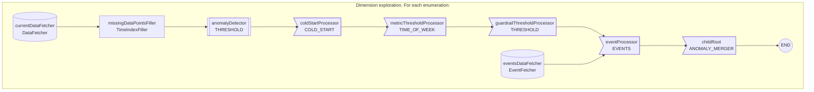

# startree-threshold-query-dx 
## Description 
Detect an anomaly if the metric is above a maximum threshold or below a minimum threshold. Aggregation function with 1 operand: SUM, MAX,etc...
Use the `enumeratorQuery` property to feed in a query that outputs different dimensions to explore.
## Flowchart 

## Parameters 
### DATA
| name | description | default value |
| --- | --- | --- |
|aggregationColumn|The column to aggregate. Can be a derived metric.|-|
|aggregationFunction|The aggregation function to apply on the aggregationColumn. Example: `AVG`.|-|
|dataSource|The Pinot datasource to use.|-|
|dataset|The dataset to query.|-|
|monitoringGranularity|The period of aggregation of the timeseries. In ISO-8601 format. Example: `PT1H`.|-|
|timezone|Timezone used to group by time. In [TZ-identifier](https://en.wikipedia.org/wiki/List_of_tz_database_time_zones#List) format.  For instance, `UTC` or `US/Pacific`.|UTC|
|timeColumn|TimeColumn used to group by time. If set to AUTO (the default value), the Pinot primary time column is used.|AUTO|
|timeColumnFormat|Required if timeColumn is not AUTO. [Learn more](https://dev.startree.ai/docs/startree-enterprise-edition/startree-thirdeye/reference/operators/data-fetcher#timeformat-strings).||
|completenessDelay|The time for your data to be considered complete and ready for anomaly detection. In ISO-8601 format. Example: `PT2H`. [Learn more](https://dev.startree.ai/docs/startree-enterprise-edition/startree-thirdeye/concepts/alert-configuration#completenessdelay).|P0D|
|queryFilters|Filters to apply when fetching data. Prefix with `AND`. Example: `AND country='US'`|${queryFilters}|
|queryLimit|Maximum number of timeseries point to fetch.|100000000|

### DETECTION
| name | description | default value |
| --- | --- | --- |
|max|If the current value is above this threshold, detect an anomaly.|-|
|min|If the current value is below this threshold, detect an anomaly.|-|

### FILTER
#### Time of week
| name | description | default value |
| --- | --- | --- |
|daysOfWeek|Used to ignore anomalies that happen at specific time periods. A list of days. Anomalies happening on these days are ignored if timeOfWeekIgnore is true. Example: `["MONDAY", "SUNDAY"]`.|[]|
|hoursOfDay|Used to ignore anomalies that happen at specific time periods. A list of hours. Anomalies happening on these hours are ignored. Example: `[0,1,2,23]`|[]|
|dayHoursOfWeek|Used to ignore anomalies that happen at specific time periods. A mapping of `{DAY: [hours]}`. Anomalies happening on these timeframes are ignored if timeOfWeekIgnore is true. Example: `{"FRIDAY": [22, 23], "SATURDAY": [0, 1, 2]}`|{}|
#### Guardrail metric
| name | description | default value |
| --- | --- | --- |
|guardrailMetricMin|Used to ignore anomalies that don't meet the guardrail threshold. Minimum threshold of the guardrail metric. If `-1`, no minimum threshold is applied.|-1|
|guardrailMetricMax|Used to ignore anomalies that don't meet the guardrail threshold. Maximum threshold of guardrailMetric. If `-1`, no maximum threshold is applied.|-1|
|guardrailMetric|Used to ignore anomalies that don't meet the guardrail threshold. Metric to use as a threshold guardrail. Example: `COUNT(*)` and set `guardrailMetricMin = 100` to ignore anomalies detected when there is less than 100 observations in the period.|COUNT(*)|
#### Special events
| name | description | default value |
| --- | --- | --- |
|eventFilterSqlFilter|Used to ignore anomalies that happen during events. Sql filter to apply on the events. [Learn more](https://dev.startree.ai/docs/startree-enterprise-edition/startree-thirdeye/reference/operators/event-fetcher#sql-filter)||
|eventFilterLookaround|Used to ignore anomalies that happen during events. Offset to apply on startTime and endTime to look around the timeframe. In ISO-8601 format. Example: `P1D`.|P2D|
|eventFilterTypes|Used to ignore anomalies that happen during events. List of event types to fetch by. Example: `["HOLIDAY", "DEPLOYMENT"]`. `[]` fetches all events. Use `["__NO_EVENTS"]` to disable.|['__NO_EVENTS']|
|eventFilterBeforeEventMargin|Used to ignore anomalies that happen during events. A period in ISO-8601 format that corresponds to a period that is also impacted by the event. Example: if beforeEventMargin is `P1D`, if event happens on `[Dec 24 0:00, Dec 25 0:00[`, the label will be applied to anomalies happening on `[Dec 23 0:00 and Dec 25 0:00[`|P0D|
|eventFilterAfterEventMargin|Used to ignore anomalies that happen during events. Same as eventFilterBeforeEventMargin at the end of the event.|P0D|

### POSTPROCESS
#### Data mutability
| name | description | default value |
| --- | --- | --- |
|mutabilityPeriod|Use if your data is mutable. ThirdEye will maintain the detection results up to date on the mutable period. For instance, if your last 10 days of data is mutable, set `P10D`. At each cron detection job, the detection results for the last 10 days will be updated.|P0D|
|reNotifyPercentageThreshold|For detection replay when data is mutable. If the percentage difference between an existing anomaly and a new anomaly on the same time frame is above this threshold, renotify. Combined with `reNotifyAbsoluteThreshold`. Both thresholds must pass to be re-notified. If zero, always renotify. If null or negative, never re-notifies.|-1|
|reNotifyAbsoluteThreshold|For detection replay when data is mutable. If the absolute difference between an existing anomaly and a new anomaly on the same time frame is above this threshold, renotify. Combined with `reNotifyPercentageThreshold`. Both thresholds must pass to be re-notified. If zero, always renotify. If null or negative, never re-notifies.|-1|
#### Anomaly merger
| name | description | default value |
| --- | --- | --- |
|mergeMaxGap|Maximum gap between 2 anomalies for anomalies to be merged. In ISO-8601 format. Example: `PT2H`. The default behavior is to merge consecutive anomalies only. To disable anomaly merging entirely, set this value to `P0D`.||
|mergeMaxDuration|Maximum duration of an anomaly merger. At merge time, if an anomaly merger would get bigger than this limit, the anomalies are not merged. In ISO-8601 format. Example: `P7D`.||

### RCA
| name | description | default value |
| --- | --- | --- |
|rcaAggregationFunction|The aggregation function to use for RCA. If the detection metric name is known to ThirdEye, this parameter is optional.||
|rcaIncludedDimensions|List of the dimensions (columns in the dataset) to use in RCA drill-downs. If not set or empty, all dimensions of the table are used. [Learn more](https://dev.startree.ai/docs/startree-enterprise-edition/startree-thirdeye/concepts/alert-configuration#dimensions).|[]|
|rcaExcludedDimensions|List of dimensions (columns in the dataset) to ignore in RCA drill-downs. If not set or empty, all dimensions of the table are used. rcaExcludedDimensions and rcaIncludedDimensions cannot be used at the same time.|[]|
|rcaEventTypes|A list of type to filter on for RCA. Only events that match such types will be shown in the RCA related events tab. [Learn more](https://dev.startree.ai/docs/startree-enterprise-edition/startree-thirdeye/concepts/alert-configuration#types).|[]|
|rcaEventSqlFilter|A Sql filter for RCA events. Only events that match the filter will be shown in the RCA related events tab. [Learn more](https://dev.startree.ai/docs/startree-enterprise-edition/startree-thirdeye/concepts/alert-configuration#sqlfilter).||

### DIMENSION_EXPLORATION
| name | description | default value |
| --- | --- | --- |
|enumeratorQuery|This is a SQL query that will run on the data source and build enumeration items from that queryExample: "SELECT DISTINCT country, device from pageviews LIMIT 100". In this case, the enumerator will generate one enumeration item for each country/device combination.|-|
|enumerationItemIdKeys|List of keys to use to identify the enumeration.   The format is the following:   <code class="codeBlockLines_node_modules-@docusaurus-theme-classic-lib-theme-CodeBlock-Content-styles-module">[    "queryFilters"  ]  </code>  The keys must be present in the `params` object of each enumeration.   The keys will be used to generate the dimension exploration id.   The id will be used to identify the enumeration in the detection pipeline.|['queryFilters']|

